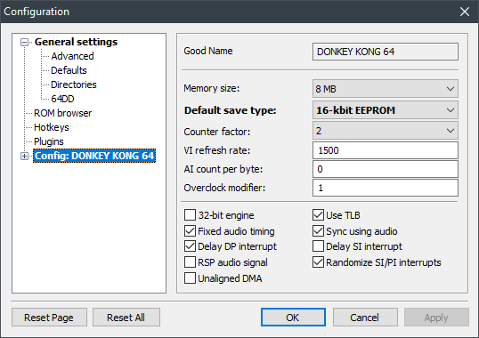

# Donkey Kong 64 - Tag Anywhere V5

Made with ❤️ by Isotarge

With help from:
- Tom Ballaam
- 2dos
- Mittenz
- retroben
- Kaze Emanuar
- SubDrag
- runehero123
- Skill
- TJ Blakely
- GloriousLiar
- Adam Whitmore
- Znernicus
- Zorulda
- ChristianVega64
- Rain
- Shygoo
- tj90241

It takes a village to free a kong.

## Controls
- D-Pad Left to tag backwards through the kong rotation
- D-Pad Right or L Button to tag forwards through the kong rotation

DK -> Diddy -> Lanky -> Tiny -> Chunky

We have put significant time and effort into ensuring that you can not tag in situations that would cause softlocks or crashes. If you hear a "denied" sound when attempting to tag, it means tagging has been temporarily disabled for that reason.

## Features
- Mystery menu options are unlocked without capturing banana fairies for your convenience.
- This patch includes two modes, toggled by the Story Skip option in the options menu.
  - Story Skip off is intended for casual players.
  - Story Skip on is intended for speedrunners to set new personal bests on [this leaderboard](https://www.speedrun.com/dk64ce#Tag_Anywhere).
- The Story Skip setting will be remembered through resets.

### Story Skip Off
- [x] Only DK unlocked from start, but you can tag anywhere once other kongs are unlocked
- [x] No other changes to gameplay

### Story Skip On
- [x] All kongs are unlocked from beginning and can immediately be tagged anywhere
- [x] All moves, guns, simian slam, shockwave, and camera unlocked from the start
- [x] Golden Banana dances skipped
- [x] All first time text skipped from beginning
- [x] Training barrels completed
- [x] File starts in in DK Isles rather than Training Grounds
- [x] K. Lumsy cutscenes compressed
  - [x] All keys behave like 3 and 8
- [x] Snide's cutscenes compressed
  - [x] Shortest contraption animation at all Snide's HQ locations
  - [x] Single golden banana animation when turning in multiple blueprints
- [x] Faster Troff 'n' Scoff feeding

## Known Issues
- Save is broken on older EverDrives
  - Nothing I can do about this unfortunately
- Save is broken on some emulators out of the box
  - Set the emulator configuration to use the "EEPROM 16K" save type
    - This might require modifying a gameDB or ini file
    - Get in touch with your emulator's author for help
  - Alternatively, use your emulator's savestate feature to save your progress between play sessions
- Save is broken and bone displacement is present on BizHawk
  - Need updated mupen64plus core in BizHawk to fix this
- Tagging immediately before hitting a tree causes you to warp to the map origin
  - Haven't thought of a good way to fix this yet
- 101% runners should enter Arcade from the mystery menu and hit "delete highscores"
  - This fills the high score table with 999950 and skips entering initials during the run
  - Probably only needs to be done once

## A note on emulation
This patch will work on both real N64 hardware and modern emulators. For the bext experience, it is recommended that you play on real N64 hardware with an EverDrive64 v3 or later.

If you do not have access to real N64 hardware, modern emulators like [m64p](https://github.com/loganmc10/m64p), [Project64](https://www.pj64-emu.com/) (v3 or later), or [mupen64plus-next](https://github.com/libretro/mupen64plus-libretro-nx) will provide a reasonable experience.

You may need to configure your emulator to use the EEPROM 16K save type for saves to persist between resets. If this option is not available, you will need to ask your emulator author to add it. In the mean time, you can use the savestate feature of your emulator to save your progress.



Please do not bug me about this, I have no control over the direction of the various emulation projects and I cannot fix it by modifying how this patch works.

## Building Pre-requisites
```
1. Python 3
2. n64chain + n64crc in your path
```

## Build Setup
```
1. Copy dk64.z64 into /src/rom
2. Run src/build.bat
```